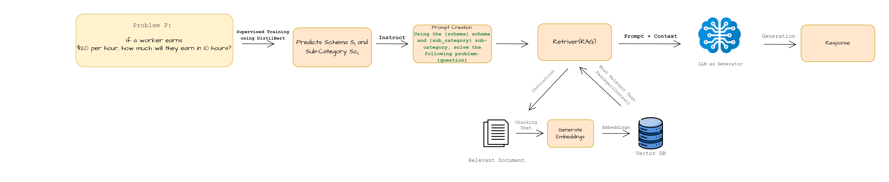

<!DOCTYPE html>
<html lang="en">
<head>
    <meta charset="UTF-8">
    <meta name="viewport" content="width=device-width, initial-scale=1.0">
    <title>SBI-RAG: Enhancing Math Word Problem Solving for Students</title>
</head>
<body>
    <h1>SBI-RAG: Enhancing Math Word Problem Solving for Students through Schema-Based Instruction and Retrieval-Augmented Generation</h1>
    
This repository provides the official implementation for <a href="https://arxiv.org/abs/2410.13293">SBI-RAG</a>, which leverages Schema-Based Instruction (SBI) and Retrieval-Augmented Generation (RAG) to help students solve math word problems by guiding them through structured, schema-driven steps.

    <h2>Architecture</h2>
    
The SBI-RAG model architecture consists of four main components:

    <ol>
        <li><strong>Schema Classification</strong>: A DistilBERT-based classifier predicts schemas and sub-categories for math word problems.</li>
        <li><strong>Prompt Creation</strong>: Generates structured prompts aligned with identified schemas.</li>
        <li><strong>Context Retrieval</strong>: Uses RAG to retrieve context to support problem-solving.</li>
        <li><strong>Response Generation</strong>: Employs Llama 3.1 to produce schema-driven, step-by-step solutions.</li>
    </ol>
    

    <h2>Requirements</h2>
    
To install the required packages, run:

    <pre><code>pip install -r requirements.txt</code></pre>

    <h2>Environment Setup</h2>
    
To set up the environment:

    <ol>
        <li>Clone this repository.</li>
        <li>Install dependencies from <code>requirements.txt</code>.</li>
        <li>Download the datasets (details below).</li>
        <li>Ensure access to Google Colab or a local setup with GPU support.</li>
    </ol>

    <h2>Data Preparation</h2>
    
This project utilizes two main datasets:

    <ul>
        <li><strong>Schema-Based Instruction (SBI) Dataset</strong>: A custom dataset of 360 labeled math word problems categorized across six schema sub-categories.</li>
        <li><strong>GSM8K Dataset</strong>: A collection of 8.5K grade school math word problems for evaluation.</li>
    </ul>
    
<strong>Note:</strong> The custom SBI dataset can be found in the repository, and GSM8K is openly accessible <a href="https://github.com/openai/grade-school-math">here</a>.

    <h2>Training</h2>
    
To train the Schema Classifier model, access the provided Colab notebook. You can experiment with different hyperparameters in the notebook’s configuration section.

    <h2>Pre-trained Models</h2>
    
Pre-trained models are available for download <a href="https://drive.google.com/drive/folders/1DnT32TGP4XAMuR1AHVeEkO0e3nMg_KmI?usp=sharing">here</a>. These models were trained on DistilBERT using default hyperparameters.

    <h2>Evaluation</h2>
    
SBI-RAG is evaluated based on reasoning clarity and correctness. Below is an overview of its performance:

    <table>
        <thead>
            <tr>
                <th>Model</th>
                <th>Top 1 Accuracy</th>
                <th>Reasoning Score (SBI-RAG)</th>
            </tr>
        </thead>
        <tbody>
            <tr>
                <td>SBI-RAG</td>
                <td>85%</td>
                <td>0.588</td>
            </tr>
            <tr>
                <td>GPT-4</td>
                <td>N/A</td>
                <td>0.491</td>
            </tr>
            <tr>
                <td>GPT-3.5 Turbo</td>
                <td>N/A</td>
                <td>0.290</td>
            </tr>
        </tbody>
    </table>
    
For detailed evaluation, refer to <code>evaluation_results.md</code>.

    <h2>Contributing</h2>
    
This repository follows the MIT License. We welcome contributions! To contribute, fork the repository, create a new branch, and submit a pull request.

</body>
</html>
